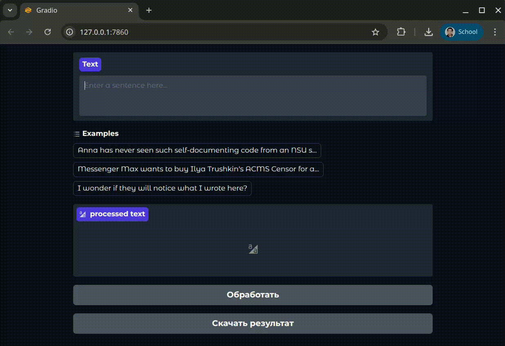

## GenAI-1-43

1. Используйте pipeline('ner').
2. Передайте текст с упоминанием персон и мест.
3. Выведите сущности и их типы.
4. Подсветите их в тексте.
5. Сохраните результат.

# Установка

1. Клонируйте репозиторий:

```
git clone https://github.com/ilushka-obnimashka/Project_activities
cd Project_activities/1task
```

2. Установите зависимости:

```
pip install -r requirements.txt
```

# Запуск

```
python main.py
```

При запуске приложения локально инициализируется веб-интерфейс на базе Gradio, обеспечивающий надежный и защищенный
режим взаимодействия.

**Ключевые характеристики интерфейса:**

1) Устойчивость к ошибкам ввода — система валидации исключает возможность формирования некорректных запросов
2) Автоматическая обработка исключений — все сбои обрабатываются без прерывания работы интерфейса
3) Строгая типизация параметров — выбор значений ограничен предопределенными допустимыми вариантами

