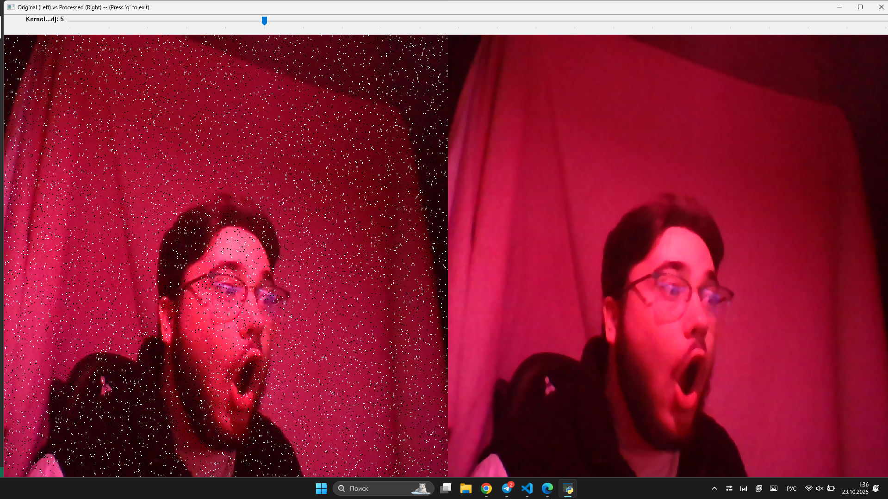

## CV-3-41 (Система фильтрации шумов в реальном времени)

1. Захватите видео с веб-камеры.
2. Для каждого кадра применяйте адаптивную фильтрацию шумов.
3. Позвольте пользователю настраивать параметры через trackbar.
4. Отобразите исходное и обработанное видео рядом.
5. Сохраните результат как видео файл.

# Ключевые особенности

Основная логика решения задания реализовано в классе `VideoProcessor`, который спроектирован для возможности
параллельной обработки кадров, используя Python
multiprocessing. Что в свою очередь может быть адаптировано для решения более сложных задач (Например : паралельная
обработка моделью нейросети каждого изображения).
(см. [`video_processor.py`](./video_processor.py))

# Установка

1. Клонируйте репозиторий:

```
git clone https://github.com/ilushka-obnimashka/Project_activities
cd Project_activities/3task
```

2. Установите зависимости:

```
pip install -r requirements.txt
```

# Запуск

```
python3 main.py 
```

## Опции запуска :

`input_puth`: Путь к видеофайлу (video/my_clip.mp4) или ID веб-камеры (0). По умолчанию: 0.

`num_workers`: Количество процессов-воркеров для обработки. По умолчанию: 1.

`--noise <type>`: Задает тип добавляемого шума. Варианты: salt_pepper, gaussian, none. По умолчанию: salt_pepper.

`--salt <float>`: Указывает вероятность "соли" (белых пикселей) для шума salt_pepper. По умолчанию: 0.02.

`--pepper <float>`: Указывает вероятность "перца" (черных пикселей) для шума salt_pepper. По умолчанию: 0.02.

`--mean <float>`: Указывает среднее значение для гауссова шума (gaussian). По умолчанию: 0.

`--sigma <float>`: Описание: Указывает стандартное отклонение (силу) для гауссова шума (gaussian). По умолчанию: 25.

`--help`: Выводит это сообщение со справкой и завершает работу.

_**При запуске приложения инициализируется окно `cv2.namedWindow()`, транслирующее обработанный и оригинальный кадры.**_


